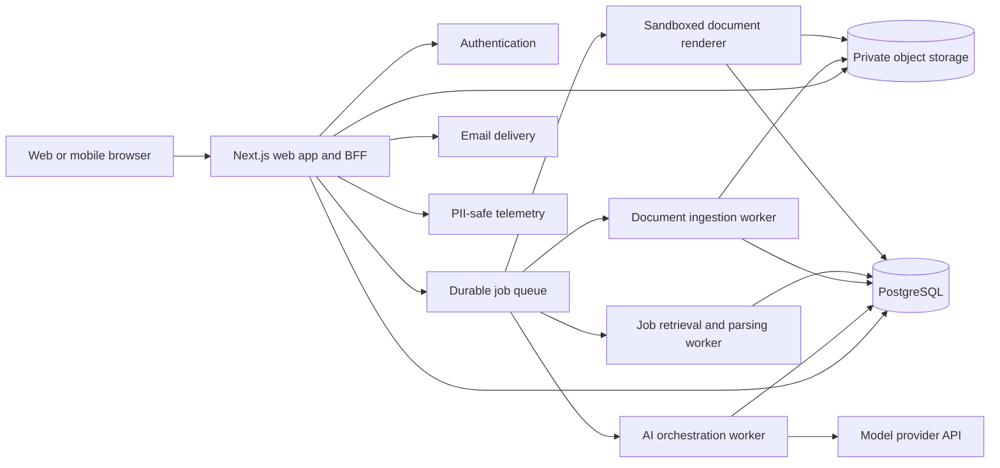

# Jobist product and technical architecture

Status: proposed architecture for an MVP

## 1. Product intent

Jobist is a hosted, accessible job-search workspace inspired by
[`p3ji/ai-job-search-ca`](https://github.com/p3ji/ai-job-search-ca). It gives a
non-technical job seeker the useful parts of that local framework without
requiring Git, a terminal, LaTeX, or a separate AI subscription.

The product promise is:

> Give us your career evidence once. For each job, understand the fit, see the
> gaps, and produce honest application material that you can inspect and edit.

It is an assistant, not an autonomous applicant. It never submits an
application, sends email, invents experience, or silently changes a user's
canonical profile.

## 2. What to preserve from the source framework

The website should preserve the framework's valuable invariants, not its local
file structure or slash-command interface.

| Source capability | Hosted product equivalent |
| --- | --- |
| `/setup` from documents, a CV, or an interview | Guided onboarding with upload, paste, and step-by-step interview paths |
| Candidate, behavioural, and writing-style files | Versioned profile, preferences, writing voice, and evidence records |
| Eligibility and language gates | Explicit pre-score gates with quoted posting evidence and user override |
| Five-part fit evaluation | A structured fit report with strengths, gaps, confidence, and recommendation |
| `/scrape` and `/rank` | Saved searches and a ranked job inbox, after the core application flow works |
| `/apply` drafter/reviewer loop | A durable background workflow with separate drafting and critique stages |
| Factual grounding audit | Every claim links to one or more profile evidence records |
| PDF compile, layout, and ATS checks | Sandboxed document renderer plus visual, text-layer, and page-limit QA |
| Application files and tracker CSV | Application workspace and event-based status timeline |
| `/outcome`, `/interview`, `/upskill` | Later modules built on the same profile, job snapshot, and application record |

The source repository is MIT licensed. If Jobist copies substantial source,
templates, or prompt text, retain the copyright and license notice. Product
ideas and independently reimplemented workflows do not require source copying,
but attribution is still appropriate.

## 3. MVP scope

### In the MVP

1. Passwordless account creation.
2. Consent and privacy choices before document upload.
3. Candidate onboarding by CV upload, text paste, or guided form.
4. A review screen to confirm every extracted fact.
5. Job input by pasted description; URL import is allowed only when retrieval is
   reliable and permitted.
6. Eligibility/language/logistics gates and a transparent fit report.
7. User confirmation before spending tokens on drafting.
8. Tailored CV and cover-letter drafts with evidence-linked claims.
9. A second-pass critique and revision.
10. In-browser editing and export to PDF and DOCX.
11. PDF page-count, layout, and ATS text-layer checks.
12. A basic application tracker and complete account/data deletion.

### Deliberately later

- Broad web scraping, scheduled searches, and every portal in the source repo.
- Email/Notion/calendar integrations.
- Company-review aggregation and salary benchmarking.
- Interview simulation and upskilling plans.
- Custom user-authored document templates.
- Auto-apply, outbound email, or one-click submission.

This sequencing tests the hardest and most valuable promise first: producing a
trustworthy application from a trustworthy profile.

## 4. User experience architecture

Do not make a chatbot the primary interface. Chat can help clarify facts, but
forms, tables, and editable documents make state visible and correctable.

### Core journey

1. **Welcome and consent**
   - Plain-language explanation of what is uploaded, why AI is used, where data
     is processed, and how to delete it.
   - Separate optional consent for product analytics and future integrations.
2. **Build my profile**
   - Upload a CV/PDF/DOCX, paste text, or answer a guided interview.
   - Show parsing progress, then present extracted facts by category.
3. **Confirm my evidence**
   - Each role, date, skill, achievement, metric, language, and work-eligibility
     fact is accepted, edited, or rejected by the user.
   - A metric without evidence is visibly marked “needs confirmation.”
4. **Add a job**
   - Paste the description by default. URL import is a convenience, with an
     obvious fallback to paste when blocked.
   - Show the source host and the captured posting snapshot.
5. **Understand the fit**
   - Run hard gates first, then show component scores, evidence, gaps, unknowns,
     and confidence. Never reduce the result to a mysterious single number.
6. **Choose whether to draft**
   - The user explicitly chooses “Create application” after seeing cost/credit
     use and the recommendation.
7. **Review the application**
   - Side-by-side job requirements and application content.
   - Selecting a sentence shows the evidence behind it.
   - Unsupported output is blocked, not merely warned about.
8. **Export and track**
   - Download PDF/DOCX, mark submitted manually, and record outcomes.

### Accessibility definition

“Accessible” means both low technical friction and disability access. Target
[WCAG 2.2 AA](https://www.w3.org/TR/WCAG22/) from the first component:

- Full keyboard use, visible focus, skip links, semantic landmarks, and no
  drag-only interaction.
- Screen-reader announcements for upload and generation status.
- Error summaries plus field-level errors; never encode score or status by
  colour alone.
- Large touch targets, responsive layout, zoom to 200%, reduced motion, and
  strong contrast.
- Plain-language labels, one decision per screen, save-and-return, and examples
  for unfamiliar questions.
- Accessible authentication: email magic link plus recovery code; no puzzle or
  memory test.
- English first, but keep all product strings externalized and data models ready
  for French. Canadian job seekers should not be locked into an English-only
  schema.
- Test with axe in CI, keyboard-only QA, NVDA/VoiceOver, and real users; an
  automated score alone is not a conformance claim.

## 5. Logical architecture



### Recommended implementation stack

- **Web/BFF:** Next.js with TypeScript. Server-render the authenticated shell and
  keep all provider credentials server-side.
- **System of record:** PostgreSQL. Use tenant-scoped access policies and
  migrations; do not store the canonical profile only as one opaque AI blob.
- **Files:** S3-compatible private object storage with short-lived signed URLs,
  encryption, malware scanning, and per-object retention metadata.
- **Background work:** a durable queue and workers. Parsing, AI calls, research,
  and PDF generation must survive browser disconnects and retries.
- **Renderer:** an isolated container with no outbound network and strict CPU,
  memory, time, and filesystem limits. Prefer a constrained first-party Typst or
  HTML/CSS template over executing user-provided LaTeX.
- **AI integration:** a provider adapter whose first implementation uses the
  OpenAI Responses API. Use Structured Outputs for every machine-consumed
  result. The application, not the model, owns workflow state.
- **Observability:** structured events with request and workflow IDs, but no CV,
  posting, or generated document text in logs or error reports.

For the MVP, these can be deployed as one web service, one worker service, one
database, and one object store. Keep logical boundaries in code; do not begin
with microservices.

## 6. Data model

All user-owned tables include `user_id`, `created_at`, `updated_at`, and a
deletion marker where needed. Use UUIDs and enforce tenant isolation in both the
database and service layer.

### Identity and consent

- `users`
- `consent_events`: policy version, purpose, choice, timestamp, locale
- `data_export_requests`
- `deletion_requests`

### Candidate source of truth

- `source_documents`: object key, type, checksum, scan status, extraction status
- `profile_versions`: immutable snapshot and active-version pointer
- `profile_facts`: typed fact such as role, date, skill, metric, language,
  eligibility, preference, or writing-style choice
- `fact_evidence`: fact-to-document/page/span mapping or explicit user statement
- `fact_confirmations`: accepted, edited, rejected, needs-confirmation

Important rule: an AI extraction proposal is not a profile fact until accepted
by the user. A later user correction creates a new profile version; it does not
rewrite historical application evidence.

### Jobs and evaluations

- `jobs`: normalized employer, title, location, language, canonical URL
- `job_snapshots`: immutable raw text, retrieval method, source host, checksum,
  retrieved time
- `job_requirements`: typed requirement, priority, verbatim source span
- `evaluations`: profile version + job snapshot + rubric version + model run
- `evaluation_dimensions`: score, rationale, confidence, supporting fact IDs
- `gates`: eligibility, language, location/logistics; pass/fail/flag/unknown with
  verbatim source span

### Applications and generated artifacts

- `applications`: job, profile version, stage, timestamps
- `workflow_runs`: state machine status, idempotency key, retry count, cost
- `draft_versions`: artifact type, content, parent version, author (user/AI)
- `claim_citations`: draft span to profile fact IDs
- `reviews`: structured edits, narrative findings, model/prompt/rubric version
- `artifacts`: PDF/DOCX object key, checksum, page count, renderer version
- `artifact_checks`: parseability, layout, contact fields, keyword coverage
- `application_events`: saved, drafted, exported, submitted, interviewed,
  rejected, offer, withdrawn, and free-form note

### Operations

- `model_runs`: provider, model, token counts, latency, status, schema version;
  store hashes/IDs rather than sensitive prompts in production logs
- `usage_ledger`: per-user credits and actual provider cost
- `audit_events`: security-relevant reads, exports, integrations, and deletion

## 7. Workflow state machines

### Profile ingestion

`uploaded -> scanned -> extracted -> user_review -> active`

Failures are resumable. Keep the source document private, preserve page/span
coordinates, and let users finish onboarding without accepting every proposed
fact.

### Application generation

`job_captured -> requirements_parsed -> gates_checked -> evaluated -> awaiting_user -> drafting -> reviewing -> revising -> rendering -> qa -> ready`

Terminal alternatives are `blocked`, `failed`, and `cancelled`. Every stage is
idempotent and records its input versions. A retry cannot accidentally create a
second application or charge twice.

The browser subscribes to workflow events via server-sent events or polls a
status endpoint. It never holds an HTTP request open for the whole AI workflow.

## 8. AI orchestration and trust boundaries

### Split the workflow into typed stages

1. `extract_profile(document) -> ProposedProfileFacts`
2. `parse_job(snapshot) -> ParsedJob`
3. `evaluate(profile, job, rubric) -> Evaluation`
4. `draft(profile, job, evaluation, style) -> DraftBundle`
5. `review(profile, job, drafts) -> ReviewResult`
6. `revise(drafts, accepted_review) -> DraftBundle`

Use strict JSON schemas between stages. This follows the official OpenAI
guidance to use Structured Outputs for schema adherence rather than relying on
“valid JSON” alone.

### Grounding rule

The drafting schema does not accept free-floating claims. Each factual sentence
or bullet includes `supporting_fact_ids`. Server-side validation rejects IDs
that do not belong to the active profile version and rejects factual content
without support. The reviewer repeats the grounding audit. The UI exposes the
links so the user can inspect them.

### Untrusted job content

Job descriptions and cached research are data, never instructions.

- Wrap them in a dedicated input field, not the system/developer prompt.
- The job parser receives no tools.
- Never follow or fetch URLs discovered inside a posting.
- Validate a user-supplied URL against an allow/deny policy, block private and
  link-local IPs, limit redirects and bytes, and resolve DNS again after each
  redirect to prevent SSRF.
- Research starts from a user-confirmed company identity in a separate stage.
- Strip scripts, styles, comments, hidden text, and tracking parameters before
  model input while preserving a raw snapshot for user inspection.

### Model and cost strategy

- Use a small, fast model for extraction/classification and a stronger model for
  final drafting/review when quality tests justify it.
- Pin model and prompt versions for reproducibility; upgrade through evals.
- Cache only non-sensitive, content-addressed transformations where policy and
  consent allow it.
- Set per-stage token caps, user quotas, concurrency limits, and a monthly kill
  switch.
- Show users when a task consumes a credit and do not retry billable work after
  a schema-valid completion.
- Maintain a golden eval set for extraction accuracy, claim grounding, gate
  classification, rubric consistency, prompt injection, bilingual output, and
  résumé quality.

The OpenAI Responses API accepts PDF and common document inputs, and PDF inputs
can include both extracted text and page images. That is useful for ingestion,
but direct parsing should still run first so page-level provenance and deletion
remain under Jobist's control. Long-running model work can run asynchronously;
Jobist should still persist its own workflow state rather than treating the
provider response object as the system of record.

## 9. Document generation

### Authoring representation

Store drafts as structured document JSON, not raw HTML, Markdown, LaTeX, or
DOCX. Render the same structure into:

- Accessible in-browser editor
- DOCX export
- PDF export
- Plain-text ATS preview

The schema should model sections, entries, date ranges, bullets, links, contact
fields, and evidence references. Only allow known components and formatting.

### Render and QA pipeline

1. Validate structured document and page-limit policy.
2. Render in a network-disabled container from a versioned template.
3. Inspect page count and bounding boxes for clipping, large holes, or orphaned
   headings.
4. Extract the PDF text layer.
5. Confirm email, phone, dates, section ordering, and character integrity.
6. Compare supported job keywords to extracted text; never add unsupported
   keywords.
7. Render page images for visual regression and optional vision QA.
8. Save checks and template/renderer versions beside the artifact.

Do not allow arbitrary user templates in v1. If added later, templates need a
constrained format and a separate security review.

## 10. Privacy and security

Career documents contain high-value identity, contact, employment, immigration,
and sometimes salary data. Treat the product as a sensitive-data application.

- Collect only what is needed for the selected workflow.
- Give a purpose-specific explanation before collection and before any optional
  integration.
- Encrypt in transit and at rest; rotate secrets; separate development and
  production data.
- Private objects only; short-lived signed downloads; no guessable URLs.
- Malware-scan uploads, validate MIME by content, cap file size/page count, and
  reject archives and executable formats.
- Require re-authentication for export, account deletion, email change, and
  integration setup.
- Offer self-serve download and deletion. Define automatic retention for raw
  uploads and abandoned accounts; deletion includes derivatives, caches, and
  provider files where applicable.
- Never use customer career content to train product models by default.
- Keep sensitive text out of analytics, logs, support tools, and session replay.
- Use least-privilege admin access with audited, time-limited support access.
- Back up encrypted data and test deletion propagation and restore procedures.
- Complete threat modelling and a privacy impact assessment before launch.

For a Canadian service, design around the Office of the Privacy Commissioner's
principles of stated purpose, limited use/disclosure, consent for new purposes,
and retention only as long as needed. Obtain legal review for the jurisdictions
where the product is offered.

OpenAI API data is not used for training according to its current data-control
documentation, but default abuse-monitoring logs may retain customer content for
up to 30 days. Zero Data Retention or Modified Abuse Monitoring requires
eligibility and approval. State the actual configured policy to users; do not
promise zero retention unless the account and every used feature qualify.

## 11. API surface

Representative REST endpoints:

```text
POST   /v1/uploads/initiate
POST   /v1/profile/extractions
GET    /v1/profile/extractions/:id
POST   /v1/profile/facts/:id/confirm
POST   /v1/profile/versions/:id/activate

POST   /v1/jobs/from-text
POST   /v1/jobs/from-url
GET    /v1/jobs/:id/snapshot
POST   /v1/jobs/:id/evaluations

POST   /v1/applications
POST   /v1/applications/:id/generate
GET    /v1/workflows/:id
POST   /v1/workflows/:id/cancel
GET    /v1/workflows/:id/events
PATCH  /v1/drafts/:id
POST   /v1/drafts/:id/render
GET    /v1/artifacts/:id/download

GET    /v1/applications
POST   /v1/applications/:id/events
GET    /v1/account/export
DELETE /v1/account
```

Mutation endpoints accept an idempotency key. Authorization derives `user_id`
from the session; clients never select a tenant by submitting a user ID.

## 12. Repository boundaries

```text
apps/
  web/                    Next.js UI and browser-facing API
  worker/                 queue consumers and workflow orchestration
packages/
  domain/                 schemas, state machines, scoring, policies
  database/               migrations and typed queries
  ai/                     provider adapter, prompts, structured outputs, evals
  documents/              document schema, templates, renderers, QA
  accessibility/          shared accessible components and test helpers
  observability/          redaction and event instrumentation
infra/
  containers/renderer/
  deployment/
docs/
  architecture.md
  threat-model.md
  privacy-data-map.md
```

The scoring rubric, gates, document rules, and schemas are versioned domain
assets. They must not be buried inside prompt strings.

## 13. Delivery plan

### Phase 0: prove the risky loop (1-2 weeks)

- One synthetic candidate and five representative Canadian postings.
- Profile schema, requirement parser, fit report, grounded draft schema.
- One résumé template and PDF/text-layer QA.
- Automated evals before any real-user data.

Exit: reviewers can trace every generated claim to evidence, and no prompt-
injection test changes workflow behaviour.

### Phase 1: private alpha (4-6 weeks)

- Auth, consent, upload, profile confirmation, pasted job descriptions.
- Fit report, explicit draft confirmation, background generation, editor,
  PDF/DOCX export, basic tracker, export/delete.
- WCAG-oriented component tests and manual assistive-technology QA.

Exit: 10-20 invited users complete the flow without operator help; generation
failures are resumable; deletion is verified end to end.

### Phase 2: beta

- Safe URL import, selected Canadian job sources, ranked inbox, French UI/content
  path, outcome tracking, interview preparation.
- Billing/credits only after measuring real per-application costs.

Exit: quality, cost, accessibility, and security service levels are measured and
supportable.

### Phase 3: expansion

- Opt-in email/Notion/calendar integrations, saved searches, notifications,
  skill-gap planning, additional countries and template families.

## 14. Architecture decisions to make before implementation

1. Is the first audience Canada-only, and is French required for alpha or beta?
2. Will users pay per application, by subscription, or will a sponsor fund use?
3. What raw-upload and inactive-account retention periods will the privacy
   policy promise?
4. Is URL import essential for alpha, or is paste-only acceptable while portal
   permissions and reliability are validated?
5. Will the MVP use only first-party templates, or must it preserve uploaded CV
   styling?
6. Which model-provider/data-residency commitments can be truthfully offered at
   launch?

## 15. Success measures

- Onboarding completion without human help.
- Percentage of extracted facts confirmed without correction.
- Unsupported-claim rate (target: zero in exported documents).
- Time from job paste to editable application.
- PDF QA pass rate and ATS text extraction quality.
- User edits per generated artifact and reason for edit.
- Screen-reader/keyboard task-completion rate.
- Cost and latency per completed application.
- Data deletion completion time and failure rate.
- Interview and response outcomes only as user-reported learning signals, never
  as guarantees of employment.

## References

- [AI Job Search Canadian fork](https://github.com/p3ji/ai-job-search-ca)
- [Source framework license](https://github.com/p3ji/ai-job-search-ca/blob/canada/LICENSE)
- [Source workflow security model](https://github.com/p3ji/ai-job-search-ca/blob/canada/SECURITY.md)
- [OpenAI Structured Outputs](https://developers.openai.com/api/docs/guides/structured-outputs)
- [OpenAI file inputs](https://developers.openai.com/api/docs/guides/file-inputs)
- [OpenAI background mode](https://developers.openai.com/api/docs/guides/background)
- [OpenAI API data controls](https://developers.openai.com/api/docs/guides/your-data)
- [WCAG 2.2](https://www.w3.org/TR/WCAG22/)
- [PIPEDA: limiting use, disclosure, and retention](https://www.priv.gc.ca/en/privacy-topics/privacy-laws-in-canada/the-personal-information-protection-and-electronic-documents-act-pipeda/p_principle/principles/p_use/)

