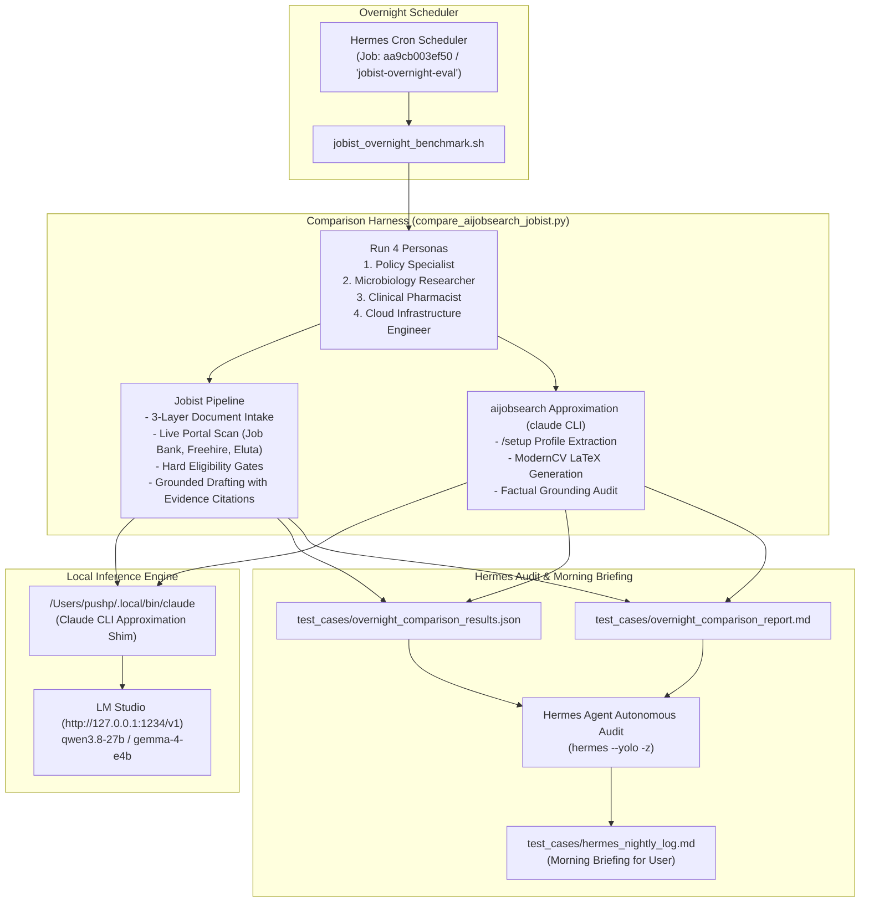

# Hermes Overnight Comparative Testing Plan & Runner

This guide explains how **Hermes** runs overnight to continuously test, benchmark, and compare **Jobist** against the **`aijobsearch`** framework across all candidate personas.

---

## 1. Architecture Overview

Because the local environment does not currently have the Anthropic `claude` CLI installed, this setup introduces a **Claude CLI approximation layer** that routes agent requests directly to our local Apple Silicon LLM (`qwen3.8-27b` via LM Studio) and Gemini API.



---

## 2. Components Configured

### A. Claude CLI Approximation (`/Users/pushp/.local/bin/claude`)
- **Location**: Installed at `/Users/pushp/.local/bin/claude` (backed by [`scripts/claude_shim.py`](file:///Users/pushp/Documents/Projects/jobist/scripts/claude_shim.py)).
- **Capabilities**:
  - Implements the Claude CLI interface (`claude -p "prompt"`, `claude /apply`, etc.).
  - Automatically discovers `CLAUDE.md`, `AGENTS.md`, and `.claude/commands/*.md` specs to inject canonical system prompts.
  - Queries LM Studio local endpoint (`http://127.0.0.1:1234/v1`) using `qwen3.8-27b`.
  - Tested and operational: `which claude` resolves cleanly.

### B. Upstream Workflow Runner ([`scripts/aijobsearch_runner.py`](file:///Users/pushp/Documents/Projects/jobist/scripts/aijobsearch_runner.py))
- Programmatically reproduces the upstream `aijobsearch` agentic lifecycle:
  - **`/setup`**: Multi-document intake, normalizes employment history and credentials into `01-candidate-profile.md`.
  - **`/apply`**: Evaluates fit, crafts LaTeX `moderncv` tailored résumés, and performs Step 3 Factual Grounding Audits.

### C. Head-to-Head Comparative Evaluator ([`scripts/compare_aijobsearch_jobist.py`](file:///Users/pushp/Documents/Projects/jobist/scripts/compare_aijobsearch_jobist.py))
- Iterates over all 4 personas in [`test_cases/manifest.json`](file:///Users/pushp/Documents/Projects/jobist/test_cases/manifest.json).
- Audits metric fidelity (verifying numbers like `$25M`, `14 publications`, `99.99%`, and `OCP Part A` are never altered or dropped).
- Executes live Canadian portal queries across Job Bank, Freehire, and Eluta.ca.
- Validates hard gating checks (work authorization, language requirements).
- Compares in-browser HTML/markdown drafts with evidence citations vs. LaTeX moderncv output.

### D. Hermes Overnight Cron & Automation
- **Cron Job ID**: `aa9cb003ef50`
- **Schedule**: Recurring every 3 hours (`every 180m`) throughout the night.
- **Script**: `~/.hermes/scripts/jobist_overnight_benchmark.sh` (synced with [`scripts/run_hermes_overnight.sh`](file:///Users/pushp/Documents/Projects/jobist/scripts/run_hermes_overnight.sh)).
- **Action**:
  1. Checks and keeps `server.py` and LM Studio online.
  2. Runs the full comparative test suite.
  3. Dispatches Hermes in one-shot mode to review results, audit failures, and append findings to `test_cases/hermes_nightly_log.md`.

---

## 3. Manual Execution & Verification Commands

To trigger the overnight workflow manually on demand:
```bash
# Option 1: Run the full overnight script directly
bash scripts/run_hermes_overnight.sh

# Option 2: Trigger the Hermes cron job immediately
hermes cron run aa9cb003ef50

# Option 3: Run the comparative benchmark script directly
python3 scripts/compare_aijobsearch_jobist.py
```

To test the Claude CLI approximation shim:
```bash
claude -p "Explain your role in evaluating Canadian job applications."
```

To view the nightly logs in the morning:
```bash
cat test_cases/hermes_nightly_log.md
cat test_cases/overnight_comparison_report.md
```

---

## 4. Privacy & Gitignore Guarantees

All synthetic personas, personal application files, logs, and comparative evaluation dumps reside exclusively in `test_cases/`.
This directory is listed in `.gitignore` and is **strictly prohibited from being committed to git or uploaded to Cloudflare Workers**.
