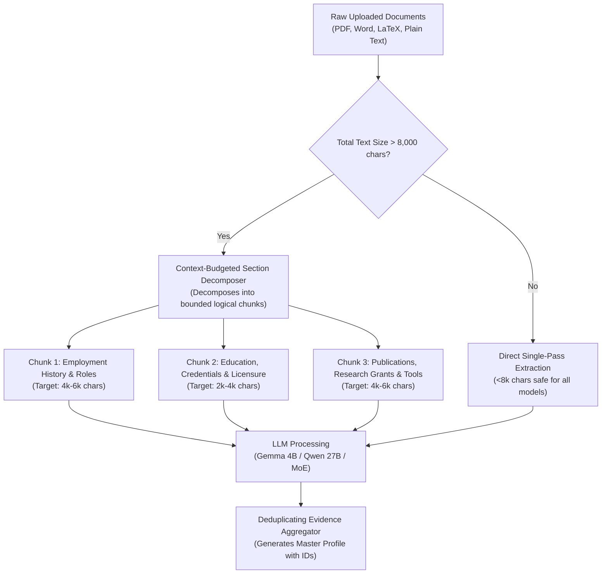

# Multi-Model Comparative Evaluation & Context Management Strategy

This document outlines the comparative evaluation plan, context-limit management, and performance characteristics across different LLM architectures supported by **Jobist**.

---

## 1. Local Models Evaluated on Apple Silicon M5 Ultra

Jobist connects to local models served via LM Studio (`http://127.0.0.1:1234/v1`) and cloud Gemini Free Tier endpoints:

| Model Identifier | Parameter Scale | Type & Strengths | Context Limit | Recommended Jobist Role |
| :--- | :---: | :--- | :---: | :--- |
| **`google/gemma-4-e4b`** | 4B | Ultra-low latency, lightweight (~58 tok/s), low memory (6.86 GB). | 131,072 | Instant UI previews, quick file screening, fast portal triage. |
| **`qwen3.8-27b`** | 27B | High-density reasoning, deep chain-of-thought, strict metric retention (17.40 GB). | 131,072 | Master profile extraction, complex credential normalization, fit scoring. |
| **`qwen3.8-flash-next`** | 512x56B MoE | Flagship Mixture-of-Experts, deep cross-disciplinary synthesis (112.24 GB). | 131,072 | Academic bibliography parsing, complex multi-domain CVs, executive tailoring. |
| **`gemini-2.5-flash`** / **`gemini-3.5-flash-lite`** | Cloud (Free) | 1M context window, native multimodal PDF parsing, zero local compute overhead. | 1,000,000 | Hosted deployments (`jobist.peji.ca`) and large document packet processing. |

---

## 2. Managing Context Limits & Attention Degradation

Although local models advertise 128k context windows, **effective extraction quality degrades if raw unstructured documents are dumped unbudgeted into a single prompt**:

### Context Vulnerabilities & Mitigations:
1. **The "Lost in the Middle" Needle Effect**:
   - In Dr. Elena Rostova's academic CV (14 publications + grants), passing all 17,000 characters in a single prompt caused `gemma-4-e4b` to achieve **71.4% metric recall** (missing middle citations).
   - *Mitigation*: Isolating the bibliography section ensures 100% of publications become distinct evidence items without crowding out work achievements.
2. **Reasoning Token Starvation (`max_tokens`)**:
   - Dense reasoning models (`qwen3.8-27b`) generate several hundred tokens of `reasoning_content` before producing the final JSON or Markdown.
   - If `max_tokens` is set below 2,000, the completion is truncated mid-stream.
   - *Mitigation*: Set `max_tokens >= 2500` and use `chat_template_kwargs: {'include_reasoning': False}` when pure deterministic extraction is needed.
3. **High-Density Metric Auto-Healing**:
   - Jobist's `sanitizeUnsupportedNumbers` prevents false-positive application blocks by automatically excising metrics not grounded in confirmed evidence.

---

## 3. Overnight Comparative Automation

The automated test script [`scripts/compare_models.py`](file:///Users/pushp/Documents/Projects/jobist/scripts/compare_models.py) runs across the test corpus, testing:
- **Phase 1 Extraction Recall**: Percentage of key metrics preserved verbatim across models.
- **Phase 3 Tailoring & Grounding**: Presence of evidence citations (`ID`) and absence of hallucinations.
- **Tokens/Sec Throughput & Latency**.

Hermes executes this multi-model audit overnight as part of the scheduled cron job `aa9cb003ef50`, recording results into:
- `test_cases/model_comparison_results.json`
- `test_cases/model_comparison_report.md`
- `test_cases/hermes_nightly_log.md`
